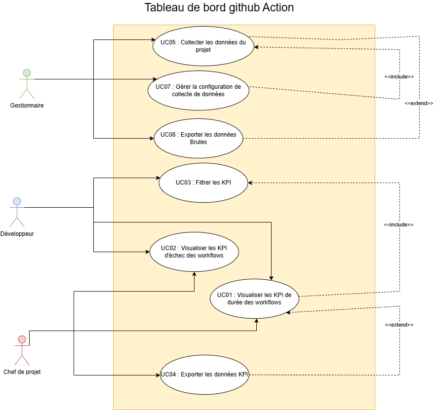

# BrokerX - Documentation d’Architecture (Arc42)

Projet réalisé dans le cadre du cours LOG795 – Projet de fin d’études en génie logiciel
Ce document suit la structure **arc42** pour documenter l’architecture du GitHub Actions Dashboard.

---

## 1. Introduction et Objectifs

### Panorama des exigences

L'objectif de ce document est de définir l'architecture du **tableau de bord intelligent pour le suivi des GitHub Actions**. Ce système vise à fournir une interface graphique intégrée permettant de visualiser des statistiques additionnelles et des métriques de performance sur les workflows GitHub Actions, aussi bien pour les dépôts publics que pour les dépôts privés auxquels l'utilisateur a accès.

**Portée incluse :**
- Une interface graphique (extension Chrome) pour visualiser des statistiques additionnelles sur les GitHub Actions
- Affichage des statistiques pour n'importe quel dépôt de code public
- Affichage des statistiques pour les dépôts privés dont l'utilisateur est propriétaire ou a accès
- Documentation technique de la solution
- Documentation utilisateur

**Portée exclue :**
- Garantie de conformité aux changements futurs de l'API ou de l'interface GitHub après la date de livraison

### Objectifs qualité

| Priorité | Objectif qualité | Scénario |
|----------|------------------|----------|
| 1 | **Utilisabilité** | L'extension Chrome doit s'intégrer de manière transparente à l'interface GitHub et afficher le tableau de bord sans quitter la page Actions |
| 2 | **Performance** | Le tableau de bord doit actualiser les données dynamiquement à chaque changement de dépôt ou branche |
| 3 | **Maintenabilité** | Le code doit être structuré, modulaire et documenté pour faciliter la maintenance |
| 4 | **Portabilité** | Le système doit être conteneurisé via Docker pour garantir la portabilité sur n'importe quelle machine |
| 5 | **Compatibilité** | L'application doit être compatible avec Google Chrome et respecter les politiques de sécurité de l'API GitHub |

### Parties prenantes

| Rôle | Attentes | Contact |
|------|----------|---------|
| **Développeur / Utilisateur GitHub** | Suivre les statistiques des workflows, filtrer par workflow/branche/acteur, identifier les problèmes dans le pipeline CI/CD | Utilisateur principal |
| **Chef d'équipe** | Analyser les performances de l'équipe, comparer les branches, repérer les patterns d'erreur | Superviseur technique |
| **Gestionnaire de projet** | Analyser le taux d'échec dans le temps, identifier les périodes instables, suivre la qualité globale du processus CI/CD | Direction projet |
| **Équipe de développement** | Implémenter et maintenir le système conformément aux spécifications | LOG795 |

---

## 2. Contraintes d’architecture

| Contrainte | Description |
|------------|-------------|
| **C01 - Extension Chrome** | Le frontend doit être développé sous forme d'extension Chrome |
| **C02 - Backend Python/Flask** | Le backend doit utiliser Python avec Flask pour assurer l'intégration avec GHAminer |
| **C03 - GHAminer obligatoire** | L'outil GHAminer (Python) doit être utilisé pour l'extraction des données GitHub Actions |
| **C04 - Conteneurisation Docker** | Le système doit être entièrement conteneurisé avec Docker et orchestré avec docker-compose |
| **C05 - Base de données PostgreSQL** | PostgreSQL doit être utilisé pour assurer la persistance des données d'exécution |
| **C06 - Exécution locale** | L'application doit pouvoir s'exécuter en local (localhost) sans dépendre d'un hébergement cloud |
| **C07 - CI/CD GitHub Actions** | Le pipeline CI/CD du projet doit être configuré via GitHub Actions |
| **C08 - Méthodologie Scrum** | L'équipe doit suivre une approche itérative Scrum avec des sprints de deux semaines |
| **C09 - Documentation du code** | Le code source doit être documenté (commentaires, README) |
| **C10 - Module Node.js** | Un module Node.js doit être intégré pour le traitement et l'analyse des données |
| **C11 - Architecture modulaire** | Séparation stricte entre services Flask (extraction) et Node.js (analyse) |
| **C12 - API REST JSON** | Le frontend doit consommer les données via une API REST au format JSON standard |

---

## 3. Portée et contexte du système

### Analyse des cas d'utilisation (CU)

#### UC-01 : Consulter le tableau de bord

Affiche le tableau de bord intégré à GitHub Actions avec statistiques globales des workflows.

**Préconditions :**
- L'extension Chrome est installée
- L'utilisateur est connecté à GitHub

**Scénario principal (succès) :**
1. L'utilisateur accède à un dépôt GitHub
2. L'utilisateur entre sont PAT GitHub dans l'extension pour que celle-ci soit capable de faire les requêtes de données nécessaires sur les dépôts GitHub.
3. Il ouvre l'onglet "Actions"
4. Le tableau de bord s'affiche automatiquement avec les statistiques globales (nombre d'exécutions, taux de réussite/échec, durée moyenne)

**Postconditions :**
- Les statistiques du dépôt sont affichées dans le tableau de bord

**Hypothèses :**
- L'utilisateur a les permissions nécessaires pour accéder au dépôt
- L'API GitHub Actions est accessible

---

#### UC-02 : Filtrer les statistiques

Permet de filtrer les résultats par workflow, auteur, branche ou période.

**Préconditions :**
- UC-01 complété

**Scénario principal (succès) :**
1. L'utilisateur ouvre le panneau de filtrage
2. Il sélectionne les critères souhaités (workflow, branche, acteur, période)
3. Le tableau de bord met à jour les données dynamiquement

**Postconditions :**
- Les statistiques affichées reflètent les filtres choisis

---

#### UC-03 : Comparer les performances entre branches

Compare la stabilité et les durées moyennes entre branches.

**Préconditions :**
- UC-01 complété

**Scénario principal (succès) :**
1. L'utilisateur sélectionne l'option "Comparer par branche"
2. Le tableau de bord affiche un graphique comparatif du taux de réussite et des durées moyennes

**Postconditions :**
- L'utilisateur identifie les branches problématiques

---

#### UC-04 : Exporter les statistiques

Permet d'exporter les données affichées du tableau de bord en CSV ou JSON.

**Préconditions :**
- UC-01 complété

**Scénario principal (succès) :**
1. L'utilisateur clique sur "Exporter les données"
2. Il choisit le format souhaité (CSV ou JSON)
3. Le système génère le fichier et le télécharge

**Postconditions :**
- Les données sont sauvegardées localement pour analyse externe

---

#### UC-05 : Analyser les échecs au fil du temps

Observe l'évolution du taux d'échec des workflows pour identifier les périodes instables.

**Préconditions :**
- UC-01 complété

**Scénario principal (succès) :**
1. L'utilisateur sélectionne une période d'analyse (jour, semaine, mois)
2. Il applique des filtres si nécessaire (workflow, acteur, branche)
3. Le système affiche un graphique linéaire illustrant le pourcentage d'échec au fil du temps
4. L'utilisateur compare les résultats selon différentes périodes

**Postconditions :**
- Les statistiques affichées reflètent les taux d'échec pour la période sélectionnée

---

#### UC-06 : Analyser la variabilité des durées

Évaluer la dispersion des temps d'exécution pour évaluer la stabilité des workflows.

**Préconditions :**
- UC-01 complété

**Scénario principal (succès) :**
1. L'utilisateur choisit la période d'analyse
2. Le système génère un graphique de dispersion (moyenne, médiane, écart-type)
3. L'utilisateur compare les valeurs statistiques
4. Il ajuste les filtres pour observer d'autres workflows

**Postconditions :**
- Les graphiques affichent la dispersion selon les filtres

---

#### UC-07 : Repérer les hausses anormales

Détecter les pics d'exécution ou d'échec pour identifier des comportements inhabituels.

**Préconditions :**
- UC-01 complété

**Scénario principal (succès) :**
1. L'utilisateur choisit un workflow et une période d'analyse
2. Le système analyse les exécutions et met en évidence les "spikes" (pics)

**Postconditions :**
- Les pics détectés sont affichés sous forme de graphiques permettant d'identifier les workflows problématiques

---

### MoSCoW des CU

#### Must-Have
- UC-01 : Consulter le tableau de bord
- UC-02 : Filtrer les statistiques
- Extraction automatique des données via GHAminer
- Affichage des indicateurs clés (taux de réussite, nombre d'exécutions, durées moyennes)

#### Should-Have
- UC-03 : Comparer les performances entre branches
- UC-05 : Analyser les échecs au fil du temps
- UC-06 : Analyser la variabilité des durées
- Stockage historique dans PostgreSQL

#### Could-Have
- UC-04 : Exporter les statistiques
- UC-07 : Repérer les hausses anormales
- Estimation du coût des workflows privés


### Glossaire (Ubiquitous Language)
| Terme | Définition |
|-------|------------|
| **Actions / Workflow** | Description des actions à prendre lorsqu'un événement survient sur GitHub (ex: push, pull request) |
| **API REST** | Interface de communication permettant l'échange de données entre le frontend et le backend via HTTP |
| **Backend** | Partie serveur chargée d'exécuter GHAminer, de traiter les données et de fournir une API REST |
| **Docker / Docker Compose** | Outils de conteneurisation pour exécuter les services de manière isolée et portable |
| **Dépôt de code / Repository** | Endroit où le code source d'un projet est stocké sur GitHub |
| **Extension Chrome** | Application intégrée au navigateur pour afficher le tableau de bord dans l'interface GitHub |
| **Flask** | Framework web Python utilisé pour créer l'API REST et exposer les données de GHAminer |
| **Frontend** | Partie visible développée en JavaScript, affiche les résultats d'analyse aux utilisateurs |
| **GHAminer** | Outil Python pour obtenir toutes les informations des workflow runs d'un dépôt spécifique |
| **GitHub** | Plateforme de stockage de code source où les Actions sont exécutées |
| **Métrique** | Valeur quantitative pour évaluer la performance (nombre d'exécutions, taux de succès, durée) |
| **Node.js** | Environnement JavaScript côté serveur pour analyser et agréger les données |
| **PostgreSQL** | Système de gestion de base de données pour le stockage persistant des métriques |
| **Workflow run** | Instance concrète d'un workflow exécuté suite à un événement GitHub |

### Diagramme de contexte                       ** TODO ** Fix with real diagramme (or remove this section)

```
┌─────────────────────────────────────────────────────────────────┐
│                        Système GitHub                           │
│  (Fournit événements, données et résultats des workflows)       │
└──────────────────────────┬──────────────────────────────────────┘
                           │
                           │ API GitHub Actions
                           │
                           ▼
┌─────────────────────────────────────────────────────────────────┐
│                         GHAminer                                │
│            (Extraction de données depuis GitHub API)            │
└──────────────────────────┬──────────────────────────────────────┘
                           │
                           │ Données brutes
                           │
                           ▼
┌─────────────────────────────────────────────────────────────────┐
│              Tableau de bord GitHub Actions                     │
│                                                                 │
│  ┌────────────┐    ┌─────────────┐    ┌──────────────┐          │
│  │  Frontend  │◄───┤   Node.js   │◄───┤    Flask     │          │
│  │  (Chrome)  │    │  (Analyse)  │    │ (Extraction) │          │
│  └────────────┘    └─────────────┘    └──────────────┘          │
│         │                  │                    │               │
│         │                  ▼                    │               │
│         │          ┌──────────────┐             │               │
│         │          │  PostgreSQL  │◄────────────┘               │
│         │          │     (BDD)    │                             │
│         │          └──────────────┘                             │
└─────────┼───────────────────────────────────────────────────────┘
          │
          │ Utilisation
          │
          ▼
┌─────────────────────────────────────────────────────────────────┐
│                     Acteurs Humains                             │
│  • Développeur / Utilisateur GitHub                             │
│  • Chef d'équipe                                                │
│  • Gestionnaire de projet                                       │
└─────────────────────────────────────────────────────────────────┘
```


## Diagramme de cas d'utilisation :
Voici le diagramme illustrant les interactions principales entre les acteurs et le système :


### Esquisse du modèle de domaine                   ** TODO ** Fix with real diagramme (or remove this section)

**Entités principales :**
- **Repository** : Dépôt GitHub contenant des workflows
- **Workflow** : Ensemble d'actions configurées pour un dépôt
- **WorkflowRun** : Instance d'exécution d'un workflow
- **Job** : Tâche individuelle au sein d'un workflow run
- **Actor** : Développeur ayant déclenché un workflow
- **Branch** : Branche Git sur laquelle le workflow s'exécute
- **Metric** : Métriques calculées (taux de succès, durée moyenne, écart-type)

**Relations :**
- Un Repository contient plusieurs Workflows
- Un Workflow a plusieurs WorkflowRuns
- Un WorkflowRun contient plusieurs Jobs
- Un Actor déclenche plusieurs WorkflowRuns
- Une Branch est associée à plusieurs WorkflowRuns
- Des Metrics sont calculées à partir des WorkflowRuns

---

## 4. Stratégie de solution

| Problème | Approche |
|----------|----------|
| **Extraction de données GitHub** | Utilisation de l'outil GHAminer (Python) pour interroger l'API GitHub Actions et récupérer les métadonnées des workflows |
| **Gestion des données** | PostgreSQL pour le stockage persistant de l'historique des métriques permettant des analyses à long terme |
| **Traitement et analyse** | Architecture à deux couches : Flask pour l'extraction brute et Node.js pour l'analyse, le filtrage et l'agrégation des statistiques |
| **Visualisation** | Extension Chrome intégrée nativement à l'interface GitHub sur la page "Actions" avec tableaux de bord et graphiques interactifs |
| **Communication** | API REST au format JSON pour la communication entre le frontend (Chrome) et le backend (Node.js/Flask) |
| **Déploiement** | Conteneurisation complète avec Docker et orchestration via docker-compose pour garantir la portabilité |
| **Filtrage avancé** | Système de filtres dynamiques permettant de segmenter les données par workflow, branche, acteur et période |
| **Qualité du code** | Pipeline CI/CD via GitHub Actions avec tests unitaires (frontend et backend) |

---

## 5. Vue des blocs de construction

### Composants principaux

#### 5.1 Frontend - Extension Chrome
**Responsabilité :** Interface utilisateur intégrée à GitHub
- Injection du tableau de bord dans la page GitHub Actions
- Affichage des graphiques et tableaux de statistiques
- Gestion des filtres utilisateur (workflow, branche, acteur, période)
- Communication avec le backend via API REST
- Exportation des données (CSV/JSON)

**Technologies :** JavaScript, HTML5, CSS3, Chrome Extension API

#### 5.2 Backend - Service Flask (Extraction)
**Responsabilité :** Extraction des données brutes depuis GitHub
- Exécution des scripts Python de GHAminer
- Interrogation de l'API GitHub Actions
- Exposition d'une API REST locale pour transmettre les données brutes
- Gestion des erreurs de connexion et des limites d'API
- Persistance initiale dans PostgreSQL

**Technologies :** Python, Flask, GHAminer, PostgreSQL

#### 5.3 Backend - Service Node.js (Analyse)                        ** TODO ** Maybe remove
**Responsabilité :** Traitement et analyse des données
- Consommation des données brutes de Flask
- Calcul des métriques agrégées (taux de succès, durées moyennes, écart-type)
- Filtrage et transformation des données selon les critères utilisateur
- Génération de statistiques de performance
- Exposition d'une API REST pour le frontend

**Technologies :** Node.js, Express.js, PostgreSQL

#### 5.4 Base de données - PostgreSQL
**Responsabilité :** Stockage persistant
- Historique des workflow runs
- Métriques calculées
- Données de jobs et d'acteurs
- Permet les analyses temporelles et comparatives

**Technologies :** PostgreSQL

### Architecture en couches                    ** TODO ** Fix with real diagramme

```
┌─────────────────────────────────────────────────────────────┐
│                    Couche Présentation                      │
│                   (Extension Chrome)                        │
│  - Interface utilisateur graphique                          │
│  - Gestion des filtres et interactions                      │
│  - Visualisation (graphiques, tableaux)                     │
└──────────────────────┬──────────────────────────────────────┘
                       │ HTTP REST (JSON)
                       │
┌──────────────────────▼──────────────────────────────────────┐
│                 Couche Application                          │
│                   (Node.js - Analyse)                       │
│  - Logique métier                                           │
│  - Calcul des métriques                                     │
│  - Filtrage et agrégation                                   │
└──────────────────────┬──────────────────────────────────────┘
                       │ HTTP REST (JSON)
                       │
┌──────────────────────▼──────────────────────────────────────┐
│              Couche Intégration                             │
│               (Flask - Extraction)                          │
│  - Exécution de GHAminer                                    │
│  - Interface avec l'API GitHub                              │
│  - Transformation des données brutes                        │
└──────────────────────┬──────────────────────────────────────┘
                       │ SQL
                       │
┌──────────────────────▼──────────────────────────────────────┐
│                Couche Persistance                           │
│                    (PostgreSQL)                             │
│  - Stockage des workflow runs                               │
│  - Historique des métriques                                 │
└─────────────────────────────────────────────────────────────┘
``` 

---

## 6. Vue d'exécution

### Diagramme de séquence pour UC-01 : Consulter le tableau de bord                    ** TODO ** Fix with real diagramme

```
Utilisateur    Extension Chrome    Node.js API    Flask API    GHAminer    GitHub API    PostgreSQL
    │                 │                 │             │            │            │             │
    │ Ouvre "Actions" │                 │             │            │            │             │
    ├────────────────>│                 │             │            │            │             │
    │                 │                 │             │            │            │             │
    │                 │ GET /metrics    │             │            │            │             │
    │                 │ (repo, filters) │             │            │            │             │
    │                 ├────────────────>│             │            │            │             │
    │                 │                 │             │            │            │             │
    │                 │                 │ GET /raw-data           │            │             │
    │                 │                 ├────────────>│            │            │             │
    │                 │                 │             │            │            │             │
    │                 │                 │             │ Execute    │            │             │
    │                 │                 │             ├───────────>│            │             │
    │                 │                 │             │            │            │             │
    │                 │                 │             │            │ GET workflows            │
    │                 │                 │             │            ├───────────>│             │
    │                 │                 │             │            │            │             │
    │                 │                 │             │            │<───────────┤             │
    │                 │                 │             │            │ Workflow data            │
    │                 │                 │             │            │            │             │
    │                 │                 │             │<───────────┤            │             │
    │                 │                 │             │ Raw data   │            │             │
    │                 │                 │             │            │            │             │
    │                 │                 │             │ Store data │            │             │
    │                 │                 │             ├────────────────────────────────────>│
    │                 │                 │             │            │            │             │
    │                 │                 │<────────────┤            │            │             │
    │                 │                 │ Raw JSON   │            │            │             │
    │                 │                 │             │            │            │             │
    │                 │                 │ Query historical data    │            │             │
    │                 │                 ├──────────────────────────────────────────────────>│
    │                 │                 │             │            │            │             │
    │                 │                 │<──────────────────────────────────────────────────┤
    │                 │                 │ Historical data          │            │             │
    │                 │                 │             │            │            │             │
    │                 │                 │ Calculate metrics        │            │             │
    │                 │                 │ (success rate, avg duration, etc.)    │             │
    │                 │                 │             │            │            │             │
    │                 │<────────────────┤             │            │            │             │
    │                 │ JSON metrics    │             │            │            │             │
    │                 │                 │             │            │            │             │
    │<────────────────┤                 │             │            │            │             │
    │ Display dashboard                │             │            │            │             │
    │                 │                 │             │            │            │             │
```

### Flux d'exécution pour UC-02 : Filtrer les statistiques

1. **Utilisateur** sélectionne des filtres (workflow, branche, acteur, période) dans l'interface
2. **Extension Chrome** envoie une requête GET avec les paramètres de filtrage à Node.js
3. **Node.js** interroge PostgreSQL avec les critères de filtrage
4. **PostgreSQL** retourne les données filtrées
5. **Node.js** recalcule les métriques pour le sous-ensemble filtré
6. **Extension Chrome** reçoit les nouvelles métriques et met à jour l'affichage dynamiquement

### Flux d'exécution pour UC-05 : Analyser les échecs au fil du temps

1. **Utilisateur** sélectionne une période d'analyse (jour/semaine/mois)
2. **Extension Chrome** envoie une requête GET avec la période à Node.js                                           ** TODO ** Maybe directly to flask
3. **Node.js** interroge PostgreSQL pour obtenir l'historique des workflow runs sur la période
4. **Node.js** calcule le taux d'échec par intervalle de temps (agrégation temporelle)
5. **Extension Chrome** reçoit les données et génère un graphique linéaire
6. **Utilisateur** visualise l'évolution du taux d'échec dans le temps  

---

## 7. Vue de déploiement

### Architecture de déploiement avec Docker                                            ** TODO ** Fix with real diagramme (or remove this section)

```
┌───────────────────────────────────────────────────────────────────┐
│                    Machine locale (Développement)                  │
│                                                                    │
│  ┌──────────────────────────────────────────────────────────────┐ │
│  │                    Google Chrome                              │ │
│  │  ┌────────────────────────────────────────────────────────┐  │ │
│  │  │         Extension GHA Dashboard                         │  │ │
│  │  │  - popup.html, popup.js                                 │  │ │
│  │  │  - contentScript.js (injection dans GitHub)             │  │ │
│  │  │  - background.js                                        │  │ │
│  │  └────────────────────────────────────────────────────────┘  │ │
│  └──────────────────────────────────────────────────────────────┘ │
│                              │                                     │
│                              │ HTTP REST :3000                     │
│                              ▼                                     │
│  ┌──────────────────────────────────────────────────────────────┐ │
│  │             Docker Compose Environment                        │ │
│  │                                                               │ │
│  │  ┌─────────────────────────────────────────────────────┐    │ │
│  │  │  Container: nodejs-service                          │    │ │
│  │  │  - Image: node:18-alpine                            │    │ │
│  │  │  - Port: 3000                                       │    │ │
│  │  │  - Service: API REST d'analyse et agrégation        │    │ │
│  │  └─────────────────────────────────────────────────────┘    │ │
│  │                       │                                       │ │
│  │                       │ HTTP :5000                            │ │
│  │                       ▼                                       │ │
│  │  ┌─────────────────────────────────────────────────────┐    │ │
│  │  │  Container: flask-service                           │    │ │
│  │  │  - Image: python:3.10-slim                          │    │ │
│  │  │  - Port: 5000                                       │    │ │
│  │  │  - Service: API REST d'extraction (GHAminer)        │    │ │
│  │  └─────────────────────────────────────────────────────┘    │ │
│  │                       │                                       │ │
│  │                       │ PostgreSQL :5432                      │ │
│  │                       ▼                                       │ │
│  │  ┌─────────────────────────────────────────────────────┐    │ │
│  │  │  Container: postgres                                │    │ │
│  │  │  - Image: postgres:15-alpine                        │    │ │
│  │  │  - Port: 5432                                       │    │ │
│  │  │  - Volume: postgres-data (persistance)              │    │ │
│  │  │  - Service: Stockage des métriques                  │    │ │
│  │  └─────────────────────────────────────────────────────┘    │ │
│  │                                                               │ │
│  └───────────────────────────────────────────────────────────────┘ │
│                              │                                     │
└──────────────────────────────┼─────────────────────────────────────┘
                               │
                               │ HTTPS API GitHub
                               ▼
                    ┌──────────────────────┐
                    │   GitHub API         │
                    │   api.github.com     │
                    └──────────────────────┘
```

### Mapping des composants sur l'infrastructure

| Composant | Infrastructure | Configuration |
|-----------|---------------|---------------|
| **Extension Chrome** | Client (navigateur) | Installée manuellement via Chrome Web Store ou en mode développeur |
| **Node.js API** | Container Docker | Port 3000, connexion à PostgreSQL, communication avec Flask |
| **Flask API** | Container Docker | Port 5000, accès à GHAminer, connexion à PostgreSQL |
| **PostgreSQL** | Container Docker | Port 5432, volume persistant `postgres-data` |
| **Docker Compose** | Hôte local | Orchestration des 3 containers, réseau interne |

### Spécifications techniques

**Requirements système :**
- Docker Desktop ou Docker Engine + docker-compose
- Google Chrome (dernière version stable)
- 2GB RAM minimum
- Connexion Internet (pour accéder à l'API GitHub)

**Ports utilisés :**
- `3000` : Node.js API (exposition externe)
- `5000` : Flask API (interne, accessible depuis Node.js)                                     ** TODO ** Maybe directly to flask
- `5432` : PostgreSQL (interne, accessible depuis Flask et Node.js)

**Volumes Docker :**
- `postgres-data` : Persistance des données de la base PostgreSQL
- `./extension` : Code source de l'extension (bind mount pour développement)

---

## 8. Concepts transversaux

### 8.1 Sécurité

- **Authentification GitHub** : L'extension utilise les tokens d'authentification GitHub de l'utilisateur déjà connecté
- **API Token** : Communication avec l'API GitHub via token personnel (PAT) pour les dépôts privés
- **HTTPS uniquement** : Toutes les communications avec GitHub se font en HTTPS
- **Validation des données** : Sanitisation des entrées utilisateur avant requêtes SQL
- **CORS** : Configuration appropriée pour permettre uniquement les requêtes depuis l'extension Chrome

### 8.2 Performance

- **Cache** : Mise en cache des résultats de requêtes fréquentes dans PostgreSQL
- **Pagination** : Récupération paginée des workflow runs pour limiter la charge mémoire
- **Agrégation côté serveur** : Calculs statistiques effectués par Node.js pour alléger le frontend
- **Indexation BDD** : Index sur les colonnes fréquemment filtrées (workflow_id, branch, actor, created_at)

### 8.3 Gestion des erreurs

- **API GitHub rate limiting** : Gestion des limites de taux avec retry et backoff exponentiel
- **Erreurs réseau** : Affichage de messages utilisateur clairs en cas d'indisponibilité
- **Données manquantes** : Valeurs par défaut et messages informatifs si aucun workflow trouvé
- **Logs structurés** : Logging centralisé dans chaque service pour faciliter le débogage

### 8.4 Tests

- **Tests unitaires frontend** : Jest pour tester les composants JavaScript
- **Tests unitaires backend** : pytest (Flask) et Jest (Node.js)                                              ** TODO ** Maybe directly to flask
- **Tests d'intégration** : Tests des flux complets via API
- **CI/CD** : Exécution automatique des tests via GitHub Actions à chaque push

---

## 9. Décisions d'architecture

### ADR-001 : Architecture en trois couches (Chrome + Node.js + Flask)                                       ** TODO ** Maybe directly to flask                

#### Statut
Acceptée

#### Contexte
Le système doit séparer les responsabilités : extraction des données, analyse/traitement, et visualisation.

#### Décision
Adopter une architecture en trois couches :
- **Flask** : Couche d'extraction (interface avec GHAminer et GitHub API)
- **Node.js** : Couche d'analyse et d'agrégation des métriques
- **Extension Chrome** : Couche de présentation et visualisation

#### Conséquences
##### Positives :
- Séparation claire des responsabilités
- Scalabilité : chaque couche peut évoluer indépendamment
- Facilite les tests unitaires par composant
- Réutilisabilité : Node.js peut servir d'autres clients que Chrome
- Spécialisation technologique (Python pour extraction, JavaScript pour analyse)

##### Négatives :
- Complexité accrue du déploiement (3 services)
- Latence potentielle due aux multiples appels HTTP
- Nécessité de gérer la synchronisation entre services

---

### ADR-002 : PostgreSQL pour la persistance

#### Statut
Acceptée

#### Contexte
Le système nécessite un stockage persistant pour l'historique des métriques et permettre des analyses temporelles.

#### Décision
Utiliser PostgreSQL comme base de données relationnelle.

#### Conséquences
##### Positives :
- Base de données robuste et éprouvée
- Support natif des requêtes complexes et agrégations
- Excellente intégration avec Python et Node.js
- Open source et bien documentée
- Support des index pour optimiser les requêtes de filtrage

##### Négatives :
- Overhead pour de petits volumes de données
- Nécessité de gérer les migrations de schéma
- Alternative time-series DB (InfluxDB) pourrait être plus adaptée pour les séries temporelles

---

### ADR-003 : Extension Chrome plutôt qu'application web standalone

#### Statut
Acceptée

#### Contexte
Le tableau de bord doit être accessible facilement par les développeurs lors de leur consultation de GitHub.

#### Décision
Développer une extension Chrome qui s'intègre directement dans l'interface GitHub.

#### Conséquences
##### Positives :
- Intégration native dans le workflow GitHub existant
- Pas besoin de changer d'onglet ou d'application
- Accès direct aux informations du dépôt en cours de consultation
- Expérience utilisateur fluide et cohérente

##### Négatives :
- Limité au navigateur Chrome (pas Firefox, Safari, Edge)
- Dépendance aux API de Chrome Extension
- Nécessite l'installation d'une extension
- Moins de contrôle sur l'environnement d'exécution

---

### ADR-004 : Conteneurisation avec Docker

#### Statut
Acceptée

#### Contexte
Le système doit être facilement déployable sur différentes machines de développement et de production.

#### Décision
Conteneuriser tous les services backend (Flask, Node.js, PostgreSQL) avec Docker et orchestrer avec docker-compose.

#### Conséquences
##### Positives :
- Portabilité garantie sur toutes les plateformes
- Isolation des dépendances
- Facilite le setup pour les nouveaux développeurs
- Environnement de développement identique à la production
- Versioning de l'infrastructure

##### Négatives :
- Courbe d'apprentissage pour Docker
- Overhead de ressources (CPU, mémoire)
- Complexité de debug dans les conteneurs

---

## 10. Exigences qualité

### Performance

| Métrique | Objectif | Mesure |
|----------|----------|--------|
| **Temps de chargement initial** | < 3 secondes | Temps entre l'ouverture de la page Actions et l'affichage du tableau de bord |
| **Temps de réponse des filtres** | < 1 seconde | Délai entre la sélection d'un filtre et la mise à jour de l'affichage |
| **Rafraîchissement des données** | < 5 secondes | Temps pour récupérer et afficher les nouvelles données GitHub |
| **Capacité de traitement** | 1000+ workflow runs | Le système doit gérer efficacement les grands dépôts |
| **Requêtes API GitHub** | Respect des rate limits | Max 5000 requêtes/heure (authentifié) |

### Utilisabilité

| Critère | Exigence |
|---------|----------|
| **Courbe d'apprentissage** | Un développeur doit pouvoir utiliser le tableau de bord sans formation préalable |
| **Accessibilité** | Interface claire avec labels explicites et hiérarchie visuelle |
| **Feedback utilisateur** | Messages d'erreur clairs et indicateurs de chargement visibles |
| **Responsive design** | Compatible avec différentes résolutions d'écran (min 1280x720) |

### Fiabilité

| Critère | Objectif |
|---------|----------|
| **Disponibilité** | 95% (service local, dépend de la disponibilité de l'API GitHub) |
| **Gestion des erreurs** | Récupération gracieuse en cas d'erreur API (retry, messages clairs) |
| **Cohérence des données** | Les métriques affichées doivent être exactes et cohérentes |
| **Tolérance aux pannes** | Le système continue de fonctionner avec des données en cache si GitHub API est indisponible temporairement |

### Maintenabilité

| Critère | Exigence |
|---------|----------|
| **Documentation code** | Tous les modules doivent avoir des commentaires explicatifs |
| **Tests unitaires** | Couverture minimale de 70% pour frontend et backend |
| **Modularité** | Architecture en couches strictement respectée |
| **Logs** | Logging structuré de tous les événements importants et erreurs |

### Sécurité

| Critère | Exigence |
|---------|----------|
| **Authentification** | Utilisation des tokens GitHub de l'utilisateur (OAuth ou PAT) |
| **Données sensibles** | Aucun stockage de credentials en clair |
| **Validation des entrées** | Sanitisation de toutes les entrées utilisateur |
| **HTTPS** | Toutes les communications externes en HTTPS |

### Disponibilité (estimé)

**Calcul :** 
- Service local : disponibilité dépend de la machine de l'utilisateur (99%+)
- Dépendance GitHub API : ~99.9% (selon GitHub SLA)
- **Disponibilité globale estimée : ~95-99%**

**Facteurs d'indisponibilité :**
- GitHub API rate limiting
- Pannes de l'API GitHub
- Problèmes réseau local
- Erreurs dans GHAminer ou les services backend

---

## 11. Risques et dettes techniques

### Risques identifiés

| ID | Risque | Impact | Probabilité | Mitigation |
|----|--------|--------|-------------|------------|
| R01 | **Changements dans l'API GitHub Actions** | Élevé | Moyen | Abstraire l'accès API via GHAminer, tests d'intégration réguliers, monitoring des changements GitHub |
| R02 | **Rate limiting de l'API GitHub** | Moyen | Élevé | Implémentation de cache, gestion intelligente des requêtes, affichage des limites à l'utilisateur |
| R03 | **Incompatibilité future de GHAminer** | Élevé | Faible | Documentation de l'interface GHAminer, prévoir une couche d'abstraction |
| R04 | **Performance dégradée sur grands dépôts** | Moyen | Moyen | Pagination, indexation BDD, cache agressif, chargement progressif |
| R05 | **Problèmes de sécurité (tokens exposés)** | Élevé | Faible | Pas de stockage de credentials, utilisation tokens Chrome, validation stricte |
| R06 | **Complexité de déploiement Docker** | Faible | Moyen | Documentation complète, scripts d'installation automatisés, support docker-compose |
| R07 | **Abandon ou évolution de Chrome Extension API** | Moyen | Faible | Veille technologique, architecture modulaire permettant migration |
| R08 | **Données incohérentes entre services** | Moyen | Moyen | Validation des données, tests d'intégration, transactions BDD |

### Dettes techniques

| Dette | Description | Priorité de résolution |
|-------|-------------|----------------------|
| **DT01 - Tests insuffisants** | Couverture de tests inférieure à 70% dans certains modules | Haute - Sprint 2 |
| **DT02 - Absence de tests E2E** | Pas de tests end-to-end automatisés pour les flux complets | Moyenne - Sprint 3 |
| **DT03 - Documentation API incomplète** | Certains endpoints manquent de documentation détaillée | Haute - Sprint 2 |
| **DT04 - Pas de monitoring en production** | Absence de logs centralisés et d'alerting | Basse - Post-MVP |
| **DT05 - Cache non implémenté** | Pas de stratégie de cache pour réduire les appels API | Moyenne - Sprint 3 |
| **DT06 - Gestion d'erreurs inconsistante** | Format des erreurs varie entre services | Moyenne - Sprint 2 |
| **DT07 - Internationalisation manquante** | Interface uniquement en français | Basse - Post-MVP |
| **DT08 - Support multi-navigateurs** | Extension limitée à Chrome uniquement | Basse - Post-MVP |

### Hypothèses et dépendances critiques

**Hypothèses :**
1. L'API GitHub Actions restera rétrocompatible ou fournira des migrations claires
2. GHAminer continuera d'être maintenu et fonctionnel
3. Les utilisateurs auront les permissions nécessaires sur les dépôts consultés
4. Docker est disponible sur les machines cibles

**Dépendances critiques :**
- **GHAminer** : Outil externe non contrôlé par l'équipe
- **GitHub API** : Service externe avec rate limiting
- **Chrome Extension API** : Dépendance à Google
- **Docker** : Requis pour le déploiement backend

---

## 12. Glossaire

| Terme | Définition |
|-------|------------|
| **Actions / Workflow** | Description des actions à prendre lorsqu'un événement survient sur GitHub (ex: push, pull request) |
| **Actor** | Développeur ayant déclenché un workflow GitHub Actions |
| **API REST** | Interface de communication permettant l'échange de données entre le frontend et le backend via HTTP |
| **Backend** | Partie serveur chargée d'exécuter GHAminer, de traiter les données et de fournir une API REST |
| **Branch** | Branche Git sur laquelle un workflow s'exécute |
| **CD** | Continuous Deployment : Pratique où chaque modification validée est déployée en production automatiquement |
| **CI** | Continuous Integration : Pratique d'intégration fréquente du code avec exécution automatisée des tests |
| **Docker / Docker Compose** | Outils de conteneurisation pour exécuter les services de manière isolée et portable |
| **Dépôt de code / Repository** | Endroit où le code source d'un projet est stocké sur GitHub |
| **Extension Chrome** | Application intégrée au navigateur pour afficher le tableau de bord dans l'interface GitHub |
| **Flask** | Framework web Python utilisé pour créer l'API REST et exposer les données de GHAminer |
| **Frontend** | Partie visible développée en JavaScript, affiche les résultats d'analyse aux utilisateurs |
| **GHAminer** | Outil Python pour obtenir toutes les informations des workflow runs d'un dépôt spécifique |
| **GitHub** | Plateforme de stockage de code source où les Actions sont exécutées |
| **Job** | Tâche individuelle au sein d'un workflow run |
| **Métrique** | Valeur quantitative pour évaluer la performance (nombre d'exécutions, taux de succès, durée) |
| **Node.js** | Environnement JavaScript côté serveur pour analyser et agréger les données |
| **PAT** | Personal Access Token : Token d'authentification GitHub pour accéder aux API |
| **PostgreSQL** | Système de gestion de base de données pour le stockage persistant des métriques |
| **Rate limiting** | Limitation du nombre de requêtes API autorisées par période de temps |
| **Spike** | Pic anormal dans les métriques (hausse soudaine d'échecs ou de durée) |
| **Workflow** | Ensemble d'actions configurées pour un dépôt GitHub |
| **Workflow run** | Instance concrète d'un workflow exécuté suite à un événement GitHub |