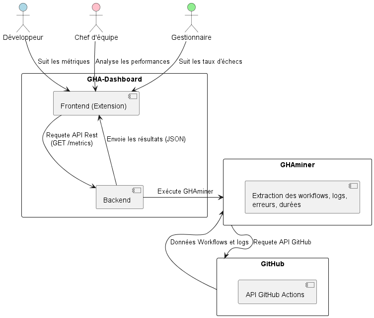
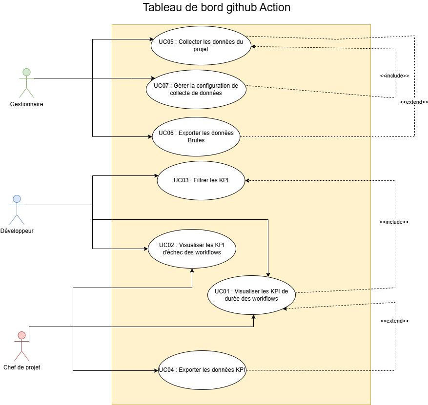
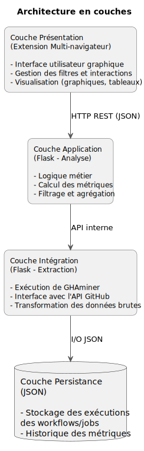
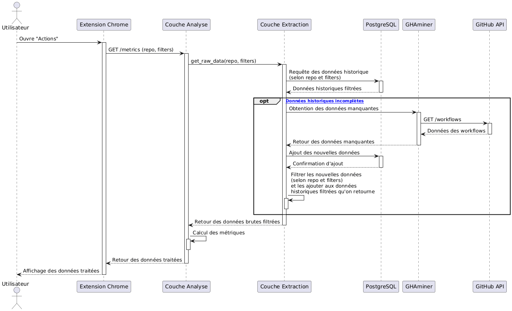

# GHA-Dashboard - Documentation d’Architecture (Arc42)

Projet réalisé dans le cadre du cours LOG795 – Projet de fin d’études en génie logiciel. 

Ce document suit la structure **arc42** pour documenter l’architecture du GitHub Actions Dashboard.

---

## 1. Introduction et Objectifs

### Panorama des exigences

L'objectif de ce document est de définir l'architecture du **tableau de bord intelligent pour le suivi des GitHub Actions**. Ce système vise à fournir une interface graphique intégrée permettant de visualiser des métriques (KPI) additionnelles et des métriques de performance sur les workflows GitHub Actions, aussi bien pour les dépôts publics que pour les dépôts privés auxquels l'utilisateur a accès.

**Portée incluse :**
- Une interface graphique (extension navigateur) pour visualiser des métriques additionnelles sur les GitHub Actions;
- Affichage des métriques pour n'importe quel dépôt de code public;
- Affichage des métriques pour les dépôts privés dont l'utilisateur est propriétaire ou a accès;
- Documentation technique de la solution;
- Documentation utilisateur.

**Portée exclue :**
- Garantie de conformité aux changements futurs de l'API ou de l'interface GitHub après la date de livraison.

### Objectifs qualité

| Priorité | Objectif qualité | Scénario |
|----------|------------------|----------|
| 1 | **Utilisabilité** | L'extension doit s'intégrer de manière transparente à l'interface GitHub et afficher le tableau de bord sans quitter la page Actions. |
| 2 | **Performance** | Le tableau de bord doit actualiser les données dynamiquement à chaque changement de dépôt ou branche. |
| 3 | **Maintenabilité** | Le code doit être structuré, modulaire et documenté pour faciliter la maintenance. |
| 4 | **Compatibilité** | L'application doit être compatible avec plusieurs navigateurs (ex: Chromium, Firefox). |

### Parties prenantes

| Rôle | Attentes | Contact |
|------|----------|---------|
| **Développeur / Utilisateur GitHub** | Suivre les métriques des workflows, filtrer par workflow/branche/acteur, identifier les problèmes dans le pipeline CI/CD. | Utilisateur principal |
| **Chef d'équipe** | Analyser les performances de l'équipe, comparer les branches, repérer les patterns d'erreur. | Superviseur technique |
| **Gestionnaire de projet** | Analyser le taux d'échec dans le temps, identifier les périodes instables, suivre la qualité globale du processus CI/CD. | Direction projet |
| **Équipe de développement** | Implémenter et maintenir le système conformément aux spécifications. | LOG795 |

---

## 2. Contraintes d’architecture

| Contrainte | Description |
|------------|-------------|
| **C01 - Extension Multi-Navigateur** | Le frontend doit être développé sous forme d'extension supportée par plusieurs navigateurs. |
| **C02 - Backend Python/Flask** | Le backend doit utiliser Python avec Flask pour assurer l'intégration avec GHAminer. |
| **C03 - GHAminer obligatoire** | L'outil GHAminer (Python) doit être utilisé pour l'extraction des données GitHub Actions. |
| **C04 - Base de données JSON** | JSON doit être utilisé pour assurer la persistance des données d'exécution. |
| **C05 - Exécution locale** | L'application doit pouvoir s'exécuter en local (localhost) sans dépendre d'un hébergement cloud. |
| **C06 - CI/CD GitHub Actions** | Le pipeline CI/CD du projet doit être configuré via GitHub Actions. |
| **C07 - Documentation du code** | Le code source doit être documenté (commentaires, README). |
| **C08 - Architecture modulaire** | Séparation stricte logique entre services d'extraction et d'analyse des données à même le serveur Flask |
| **C09 - API REST JSON** | Le frontend doit consommer les données via une API REST au format JSON standard |
| **C10 - Sécurisation des données** | Le système doit préserver la confidentialité du token GitHub et éviter son exposition dans les journaux, les messages d’erreur, l’interface utilisateur ou le réseau local. |

---

## 3. Portée et contexte du système

### Analyse des cas d'utilisation (CU)

#### UC-01 : Consulter le tableau de bord

Affiche le tableau de bord intégré à GitHub Actions avec métriques globales des workflows.

**Préconditions :**
- L'extension doit être installée;
- L'utilisateur est connecté à GitHub.

**Scénario principal (succès) :**
1. L'utilisateur accède à un dépôt GitHub.
2. L'utilisateur s'authentifie à l'extension dans le popup.
3. Il ouvre l'onglet "GHA-Dashboard".
4. L'utilisateur démarre la collecte des données.
5. Le tableau de bord affiche les métriques globales (nombre d'exécutions, taux de réussite/échec, durée moyenne).

**Postconditions :**
- Les métriques du dépôt sont affichées dans le tableau de bord.

**Hypothèses :**
- L'utilisateur a les permissions nécessaires pour accéder au dépôt
- L'API GitHub Actions est accessible.

---

#### UC-02 : Filtrer les métriques

Permet de filtrer les résultats par workflow, auteur, branche ou période.

**Préconditions :**
- UC-01 complété.

**Scénario principal (succès) :**
1. L'utilisateur ouvre le panneau de filtrage.
2. Il sélectionne les critères souhaités (workflow, branche, acteur, période).
3. Le tableau de bord met à jour les données dynamiquement.

**Postconditions :**
- Les métriques affichées reflètent les filtres choisis.

#### UC-03 : Analyser les échecs au fil du temps

Observe l'évolution du taux d'échec des workflows pour identifier les périodes instables.

**Préconditions :**
- UC-01 complété.

**Scénario principal (succès) :**
1. L'utilisateur sélectionne une période d'analyse (jour, semaine, mois).
2. Il applique des filtres si nécessaire (workflow, acteur, branche).
3. Le système affiche un graphique linéaire illustrant le pourcentage d'échec au fil du temps.
4. L'utilisateur compare les résultats selon différentes périodes.

**Postconditions :**
- Les métriques affichées reflètent les taux d'échec pour la période sélectionnée.

---

#### UC-04 : Analyser la variabilité des durées

Évaluer la dispersion des temps d'exécution pour évaluer la stabilité des workflows.

**Préconditions :**
- UC-01 complété.

**Scénario principal (succès) :**
1. L'utilisateur choisit la période d'analyse.
2. Le système génère un graphique de dispersion (moyenne, médiane, écart-type).
3. L'utilisateur compare les valeurs métriques.
4. Il ajuste les filtres pour observer d'autres workflows.

**Postconditions :**
- Les graphiques affichent la dispersion selon les filtres.

> [!WARNING]
> TODO : completer le reste des CUs une fois que le projet est rendu à la dernière itération

### Glossaire (Ubiquitous Language)
| Terme | Définition |
|-------|------------|
| **Actions / Workflow** | Description des actions à prendre lorsqu'un événement survient sur GitHub (ex: push, pull request). |
| **API REST** | Interface de communication permettant l'échange de données entre le frontend et le backend via HTTP. |
| **Backend** | Partie serveur chargée d'exécuter GHAminer, de traiter les données et de fournir une API REST. |
| **Dépôt de code / Repository** | Endroit où le code source d'un projet est stocké sur GitHub. |
| **Extension Multi-Navigateur** | Application intégrée au navigateur pour afficher le tableau de bord dans l'interface GitHub. |
| **Flask** | Framework web Python utilisé pour créer l'API REST et exposer les données de GHAminer. |
| **Frontend** | Partie visible développée en JavaScript, affiche les résultats d'analyse aux utilisateurs. |
| **GHAminer** | Outil Python pour obtenir toutes les informations des workflow runs d'un dépôt spécifique. |
| **GitHub** | Plateforme de stockage de code source où les Actions sont exécutées. |
| **Métrique** | Valeur quantitative pour évaluer la performance (nombre d'exécutions, taux de succès, durée). |
| **Workflow run** | Instance concrète d'un workflow exécuté suite à un événement GitHub. |

### Diagramme de contexte              

Le diagramme ci-dessous présente l'environement global du système, montrant les interactions entre les acteurs, GitHub, GHAminer, le serveur Flask et le tableau de bord :

---

## Diagramme de cas d'utilisation :
Voici le diagramme illustrant les interactions principales entre les acteurs et le système :

> [!WARNING]
> À mettre à jour une fois que le développement est quasi-complété

---

## 4. Stratégie de solution

| Problème | Approche |
|----------|----------|
| **Extraction de données GitHub** | Utilisation de l'outil GHAminer (Python) pour interroger l'API GitHub Actions et récupérer les métadonnées des workflows. |
| **Gestion des données** | JSON pour le stockage persistant de l'historique des métriques permettant des analyses à long terme. |
| **Visualisation** | Extension intégrée nativement à l'interface GitHub sur la page "Actions" avec tableaux de bord et graphiques interactifs. |
| **Communication** | API REST au format JSON pour la communication entre le frontend (navigateur) et le backend (Flask), |
| **Déploiement** | Déploiement local sur la machine de l'utilisateur.  |
| **Filtrage avancé** | Système de filtres dynamiques permettant de segmenter les données par workflow, branche, acteur et période. |
| **Qualité du code** | Pipeline CI/CD via GitHub Actions avec tests unitaires (frontend et backend). |

---

## 5. Vue des blocs de construction

### Composants principaux

#### 5.1 Frontend - Extension Multi-Navigateur
**Responsabilité :** Interface utilisateur intégrée à GitHub :

**Technologies :** React.js, JavaScript, CSS3, HTLM5, PlayWright

#### 5.2 Backend - Service Flask (Analyse)
**Responsabilité :** Traitement et analyse des données

**Technologies :** Python, Flask, JSON

#### 5.3 Backend - Service Flask (Extraction)
**Responsabilité :** Extraction des données brutes depuis GitHub

**Technologies :** Python, Flask, GHAminer, JSON

### Architecture en couches                   

## 6. Vue d'exécution

### Diagramme de séquence pour UC-01 : Consulter le tableau de bord

### Flux d'exécution pour UC-02 : Filtrer les métriques

1. **Utilisateur** sélectionne des filtres (workflow, branche, acteur, période) dans l'interface..
2. **Extension Multi-navigateur** envoie une requête GET avec les paramètres de filtrage à Flask. 
3. **Flask** interroge JSON avec les critères de filtrage
4. **Flask** recalcule les métriques pour le sous-ensemble filtré
5. **Extension Multi-Navigateur** reçoit les nouvelles métriques et met à jour l'affichage dynamiquement

> [!WARNING]
> TODO

### Flux d'exécution pour UC-05 : Analyser les échecs au fil du temps

1. **Utilisateur** sélectionne une période d'analyse (jour/semaine/mois)
2. **Extension Multi-Navigateur** envoie une requête GET avec la période à Flask
3. **Flask** interroge JSON pour obtenir l'historique des workflow runs sur la période
4. **Flask** calcule le taux d'échec par intervalle de temps (agrégation temporelle)
5. **Extension Multi-Navigateur** reçoit les données et génère un graphique linéaire
6. **Utilisateur** visualise l'évolution du taux d'échec dans le temps  

---

## 7. Vue de déploiement

### Architecture de déploiement en local

#### Backend (Flask)

Lancement local via `backend/python app.py` sur le port `3000`.

#### Frontend (React)

Chargement de l'extension en selon le navigateur utilisé.

Pour plus d'informations sur la configuration nécessaire, voir le`README.md` à la racine de ce projet.

##### Chromium

Charger l'extension non empaquetée en pointant vers `extension/build` (vérifiez que le monde développeur est activé).

##### Firefox

Charger l'extension temporaire en pointant vers `extension/build/manifest`.

### Mapping des composants sur l'infrastructure

| Composant | Infrastructure | Configuration |
|-----------|---------------|---------------|
| **Extension Multi-Navigateur** | Client (navigateur) | Installée manuellement via le magasin des extensions ou en mode développeur |
| **Flask API** | Serveur Flask | Port 3000, accès à GHAminer |

### Spécifications techniques

**Requirements système :**
- Dernière version stable du navigateur
- 2GB RAM minimum
- Connexion Internet (pour accéder à l'API GitHub)

**Ports utilisés :**
- `3000` : Flask API (exposition externe)
---

## 8. Concepts transversaux

### 8.1 Sécurité

- **Authentification GitHub** : L'extension utilise les tokens d'authentification GitHub de l'utilisateur déjà connecté.
  - Par OAuth App de GitHub ou la copie manuelle du token.
- **API Token** : Communication avec l'API GitHub via token personnel (PAT) pour les dépôts privés.
- **HTTPS uniquement** : Toutes les communications avec GitHub se font en HTTPS.
- **CORS** : Configuration appropriée pour permettre uniquement les requêtes depuis l'extension Multi-Navigateur.

### 8.2 Performance

- **Cache** : Mise en cache des résultats de requêtes fréquentes dans JSON.
- **Pagination** : Récupération paginée des workflow runs pour limiter la charge mémoire.
- **Agrégation côté serveur** : Calculs métriques effectués par Flask pour alléger le frontend.

### 8.3 Gestion des erreurs

- **API GitHub rate limiting** : Gestion des limites de taux avec retry et backoff exponentiel.
- **Erreurs réseau** : Affichage de messages utilisateur clairs en cas d'indisponibilité.
- **Données manquantes** : Valeurs par défaut et messages informatifs si aucun workflow trouvé.
- **Logs structurés** : Logging centralisé dans chaque service pour faciliter le débogage.

### 8.4 Tests

- **Tests unitaires frontend** : Lancés automatiquement avec PlayWright.
- **Tests unitaires backend** : pytest (Flask).
- **Tests e2e** : Tests des flux complets via PlayWright.
- **CI** : Exécution automatique des tests via GitHub Actions à chaque push.

---

## 9. Décisions d'architecture

### ADRs du projet

Voir le dossier `adr` pour plus d'informations.

---

## 10. Exigences qualité

### Performance

| Métrique | Objectif | Mesure |
|----------|----------|--------|
| **Temps de chargement initial** | < 3 secondes | Temps entre l'ouverture de la page Actions et l'affichage du tableau de bord. |
| **Temps de réponse des filtres** | < 1 seconde | Délai entre la sélection d'un filtre et la mise à jour de l'affichage. |
| **Rafraîchissement des données** | < 5 secondes | Temps pour récupérer et afficher les nouvelles données GitHub. |
| **Capacité de traitement** | 1000+ workflow runs | Le système doit gérer efficacement les grands dépôts. |
| **Requêtes API GitHub** | Respect des rate limits | Max 5000 requêtes/heure (authentifié). |

### Utilisabilité

| Critère | Exigence |
|---------|----------|
| **Courbe d'apprentissage** | Un développeur doit pouvoir utiliser le tableau de bord sans formation préalable. |
| **Accessibilité** | Interface claire avec labels explicites et hiérarchie visuelle. |
| **Feedback utilisateur** | Messages d'erreur clairs et indicateurs de chargement visibles. |
| **Responsive design** | Compatible avec différentes résolutions d'écran (min 1280x720). |

### Fiabilité

| Critère | Objectif |
|---------|----------|
| **Disponibilité** | 95% (service local, dépend de la disponibilité de l'API GitHub). |
| **Gestion des erreurs** | Récupération gracieuse en cas d'erreur API (retry, messages clairs). |
| **Cohérence des données** | Les métriques affichées doivent être exactes et cohérentes. |
| **Tolérance aux pannes** | Le système continue de fonctionner avec des données en cache si GitHub API est indisponible temporairement. |

### Maintenabilité

| Critère | Exigence |
|---------|----------|
| **Documentation code** | Tous les modules doivent avoir des commentaires explicatifs. |
| **Modularité** | Architecture en couches strictement respectée. |
| **Logs** | Logging structuré de tous les événements importants et erreurs. |

### Sécurité

| Critère | Exigence |
|---------|----------|
| **Authentification** | Utilisation des tokens GitHub de l'utilisateur (OAuth et/ou PAT). |
| **Données sensibles** | Aucun stockage de credentials en clair. |
| **Validation des entrées** | Sanitisation de toutes les entrées utilisateur. |
| **HTTPS** | Toutes les communications externes en HTTPS. |

### Disponibilité (estimé)

**Calcul :** 
- Service local : disponibilité dépend de la machine de l'utilisateur (99%+);
- Dépendance GitHub API : ~99.9% (selon GitHub SLA);
- **Disponibilité globale estimée : ~95-99%**.

**Facteurs d'indisponibilité :**
- GitHub API rate limiting;
- Pannes de l'API GitHub;
- Problèmes réseau local;
- Erreurs dans GHAminer ou les services backend.

---

## 11. Risques et dettes techniques

### Risques identifiés

| ID | Risque | Impact | Probabilité | Mitigation |
|----|--------|--------|-------------|------------|
| R01 | **Changements dans l'API GitHub Actions** | Élevé | Moyen | Abstraire l'accès API via GHAminer, tests d'intégration réguliers, monitoring des changements GitHub. |
| R02 | **Rate limiting de l'API GitHub** | Moyen | Élevé | Implémentation de cache, gestion intelligente des requêtes, affichage des limites à l'utilisateur. |
| R03 | **Incompatibilité future de GHAminer** | Élevé | Faible | Documentation de l'interface GHAminer, prévoir une couche d'abstraction. |
| R04 | **Performance dégradée sur grands dépôts** | Moyen | Moyen | Pagination, indexation BDD, cache agressif, chargement progressif. |
| R05 | **Données incohérentes entre services** | Moyen | Moyen | Validation des données, tests d'intégration, transactions BDD. |

### Dettes techniques

| Dette | Description | Priorité de résolution |
|-------|-------------|----------------------|
| **DT01 - Documentation API incomplète** | Certains endpoints manquent de documentation détaillée | Haute |
| **DT02 - Gestion d'erreurs inconsistante** | Format des erreurs varie entre services | Moyenne |

### Hypothèses et dépendances critiques

**Hypothèses :**
1. L'API GitHub Actions restera rétrocompatible ou fournira des migrations claires;
2. GHAminer continuera d'être maintenu et fonctionnel;
3. Les utilisateurs auront les permissions nécessaires sur les dépôts consultés.

**Dépendances critiques :**
- **GHAminer** : Outil externe non contrôlé par l'équipe;
- **GitHub API** : Service externe avec rate limiting.

---

## 12. Glossaire

| Terme | Définition |
|-------|------------|
| **Actions / Workflow** | Description des actions à prendre lorsqu'un événement survient sur GitHub (ex: push, pull request) |
| **Actor** | Développeur ayant déclenché un workflow GitHub Actions |
| **API REST** | Interface de communication permettant l'échange de données entre le frontend et le backend via HTTP |
| **Backend** | Partie serveur chargée d'exécuter GHAminer, de traiter les données et de fournir une API REST |
| **Branch** | Branche Git sur laquelle un workflow s'exécute |
| **CD** | Continuous Deployment : Pratique où chaque modification validée est déployée en production automatiquement |
| **CI** | Continuous Integration : Pratique d'intégration fréquente du code avec exécution automatisée des tests |
| **Dépôt de code / Repository** | Endroit où le code source d'un projet est stocké sur GitHub |
| **Extension Multi-Navigateur** | Application intégrée au navigateur pour afficher le tableau de bord dans l'interface GitHub |
| **Flask** | Framework web Python utilisé pour créer l'API REST et exposer les données de GHAminer |
| **Frontend** | Partie visible développée en JavaScript, affiche les résultats d'analyse aux utilisateurs |
| **GHAminer** | Outil Python pour obtenir toutes les informations des workflow runs d'un dépôt spécifique |
| **GitHub** | Plateforme de stockage de code source où les Actions sont exécutées |
| **Job** | Tâche individuelle au sein d'un workflow run |
| **Métrique** | Valeur quantitative pour évaluer la performance (nombre d'exécutions, taux de succès, durée) |
| **PAT** | Personal Access Token : Token d'authentification GitHub pour accéder aux API |
| **Rate limiting** | Limitation du nombre de requêtes API autorisées par période de temps |
| **Spike** | Pic anormal dans les métriques (hausse soudaine d'échecs ou de durée) |
| **Workflow** | Ensemble d'actions configurées pour un dépôt GitHub |
| **Workflow run** | Instance concrète d'un workflow exécuté suite à un événement GitHub |