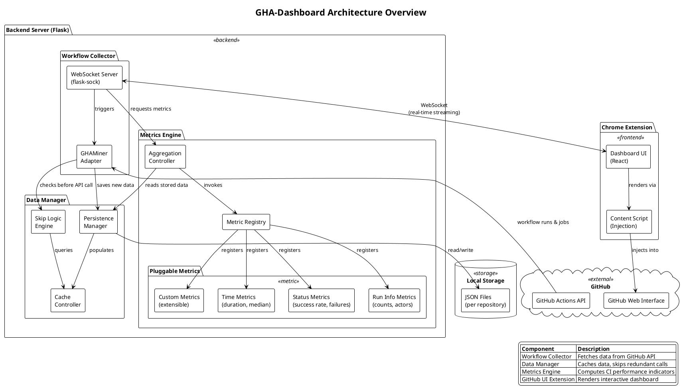

# GHA-Dashboard: Tool Implementation Additions

## Data Manager Component Description

Add this as a new component (⬡ or another symbol) in Section 2:

---

**⬡ Data Manager.** A local persistence and intelligent caching module that optimizes API usage by eliminating redundant data collection. The Data Manager stores collected workflow runs and job details in JSON files organized by repository, enabling incremental data collection across sessions. When a user initiates data collection for a previously analyzed repository, the module performs three key optimizations: (1) **Run-level deduplication** — individual runs are skipped if their identifiers already exist in local storage; (2) **Page-level skip logic** — entire pages of workflow runs are bypassed when their temporal boundaries (earliest and latest run dates) fall within the date range of previously collected data, with an adaptive algorithm that estimates how many subsequent pages can also be skipped based on date coverage ratios; and (3) **Job-level skip logic** — API calls to fetch job details are avoided for runs whose jobs have already been collected. This component also implements a backtracking mechanism: if the skip algorithm advances too aggressively and encounters a page with no cached runs, it re-evaluates previous pages to ensure no data gaps occur. Together, these strategies significantly reduce collection time for repositories with existing data while ensuring complete coverage of newly created workflow runs.

---

## Architecture Overview

### Figure Description

The architecture diagram (Figure X) illustrates the four main components of GHA-Dashboard and their interactions. Data flows from the GitHub API through the **Workflow Collector** and **Data Manager** on the backend, is transformed by the **Metrics Engine**, and rendered by the **GitHub UI Extension** on the frontend. The diagram emphasizes the extensible design of the Metrics Engine by showing its pluggable metric modules.

### PlantUML Diagram



### ASCII Architecture Diagram (Alternative)

```
┌─────────────────────────────────────────────────────────────────────────────────┐
│                              GHA-Dashboard Architecture                          │
└─────────────────────────────────────────────────────────────────────────────────┘

                    ┌──────────────────────────────────────┐
                    │           GitHub Platform            │
                    │  ┌─────────────┐  ┌──────────────┐  │
                    │  │ Actions API │  │ Web Interface│  │
                    │  └──────┬──────┘  └───────┬──────┘  │
                    └─────────┼─────────────────┼─────────┘
                              │                 │
                              │                 │ injects UI
                              ▼                 ▼
┌─────────────────────────────────────────────────────────────────────────────────┐
│                           Backend Server (Flask)                                 │
│                                                                                  │
│  ┌────────────────────┐    ┌────────────────────┐    ┌────────────────────────┐ │
│  │  Workflow Collector│    │    Data Manager    │    │     Metrics Engine     │ │
│  │  ─────────────────│    │  ─────────────────│    │  ────────────────────  │ │
│  │                    │    │                    │    │                        │ │
│  │ ┌────────────────┐ │    │ ┌────────────────┐ │    │ ┌────────────────────┐ │ │
│  │ │  GHAMiner      │◄├────┼─┤  Skip Logic    │ │    │ │  Metric Registry   │ │ │
│  │ │  Adapter       │ │    │ │  Engine        │ │    │ │  (plugin system)   │ │ │
│  │ └───────┬────────┘ │    │ └───────┬────────┘ │    │ └─────────┬──────────┘ │ │
│  │         │          │    │         │          │    │           │            │ │
│  │ ┌───────▼────────┐ │    │ ┌───────▼────────┐ │    │   ┌───────▼──────┐     │ │
│  │ │  WebSocket     │ │    │ │  Persistence   │ │    │   │   Metrics    │     │ │
│  │ │  Server        │─┼────┼─►  Manager       │◄┼────┼───┤   Modules    │     │ │
│  │ │  (flask-sock)  │ │    │ │                │ │    │   │              │     │ │
│  │ └───────┬────────┘ │    │ └───────┬────────┘ │    │   │ ┌──────────┐ │     │ │
│  └─────────┼──────────┘    └─────────┼──────────┘    │   │ │  Time    │ │     │ │
│            │                         │               │   │ │  Status  │ │     │ │
│            │                         ▼               │   │ │  RunInfo │ │     │ │
│            │               ┌─────────────────┐       │   │ │  Custom  │ │     │ │
│            │               │   JSON Files    │       │   │ └──────────┘ │     │ │
│            │               │ (per repository)│       │   └──────────────┘     │ │
│            │               └─────────────────┘       └────────────────────────┘ │
└────────────┼────────────────────────────────────────────────────────────────────┘
             │
             │ WebSocket (real-time streaming)
             ▼
┌─────────────────────────────────────────────────────────────────────────────────┐
│                         Chrome Extension (Frontend)                              │
│                                                                                  │
│  ┌──────────────────────────────────────────────────────────────────────────┐   │
│  │                         GitHub UI Extension                               │   │
│  │  ┌────────────────────┐              ┌─────────────────────────────────┐ │   │
│  │  │   Content Script   │              │        Dashboard UI (React)     │ │   │
│  │  │   (DOM Injection)  │─────────────►│  • KPI Cards    • Charts        │ │   │
│  │  │                    │              │  • Filters      • Tooltips      │ │   │
│  │  └────────────────────┘              │  • Progress     • Export        │ │   │
│  │                                      └─────────────────────────────────┘ │   │
│  └──────────────────────────────────────────────────────────────────────────┘   │
└─────────────────────────────────────────────────────────────────────────────────┘

                              ┌─────────────────────────────┐
                              │      Data Flow Legend       │
                              │  ─────────────────────────  │
                              │  ───►  Request/Response     │
                              │  ◄───  Data Flow            │
                              │  ─ ─►  Real-time Stream     │
                              └─────────────────────────────┘
```

### Architecture Overview Text (for paper)

Add after the component descriptions:

---

**Architecture Overview.** Figure X presents the high-level architecture of GHA-Dashboard, illustrating the interactions between its four components. The system follows a streaming pipeline architecture where data flows from the GitHub Actions API through the backend to the browser extension.

When a user opens the Actions Dashboard for a repository, the **GitHub UI Extension** establishes a WebSocket connection to the backend. The **Workflow Collector** initiates data retrieval from GitHub's REST API, first consulting the **Data Manager** to determine which runs and jobs can be skipped based on locally cached data. As new workflow runs are fetched, they are simultaneously (1) persisted to local JSON storage for future sessions, (2) processed by the **Metrics Engine** to compute aggregated indicators, and (3) streamed to the frontend for real-time visualization.

The **Metrics Engine** employs a plugin architecture centered around a Metric Registry that maintains registered calculators. Each metric module—whether computing time-based statistics (median duration, time-to-fix), status indicators (success rate, failure counts), or run metadata (contributor activity, branch comparisons)—implements a common `MetricCalculator` interface and registers itself with the central registry. This design enables practitioners and researchers to extend GHA-Dashboard with new metrics by implementing a single class without modifying existing aggregation logic.

The **Data Manager** acts as an intermediary between the Workflow Collector and local storage, maintaining an in-memory cache of previously collected data. Before each API call, it evaluates whether the requested data already exists, applying skip logic at three granularities: individual runs, entire pages of runs (based on date range coverage), and job details for specific runs. This optimization is particularly impactful for large repositories where re-analyzing historical data would otherwise require thousands of API calls.

---

## Component Interaction Sequence (Optional Addition)

For a more detailed view, you could include this sequence description:

1. **User Action**: User clicks "Actions Dashboard" in GitHub's navigation
2. **UI Injection**: Content script detects the click and injects the React dashboard into an iframe
3. **Connection**: Dashboard establishes WebSocket connection to Flask backend
4. **Cache Check**: Backend queries Data Manager for existing data for this repository
5. **Skip Optimization**: Data Manager returns cached runs and identifies gaps
6. **API Collection**: Workflow Collector fetches only missing data from GitHub API
7. **Persistence**: New data is saved to local JSON storage
8. **Aggregation**: Metrics Engine computes indicators on combined (cached + new) data
9. **Streaming**: Processed data streams to frontend via WebSocket
10. **Rendering**: Dashboard updates charts and KPIs in real-time
11. **Completion**: Final metrics displayed; data available for future sessions

---

## Key Design Decisions

| Decision | Rationale |
|----------|-----------|
| JSON file storage (per repo) | Simple, portable, no database dependencies; enables easy backup/sharing |
| WebSocket streaming | Immediate feedback during long-running collections; better UX than batch loading |
| Plugin-based metrics | Facilitates community contributions; separates concerns; enables selective computation |
| Page-level skip logic | Balances API efficiency with data completeness; single-run checks too slow for large repos |
| In-memory caching | Avoids repeated disk reads during collection; invalidated after session |
| Adaptive skip estimation | Uses date coverage ratios to skip multiple pages; backtracking prevents gaps |


